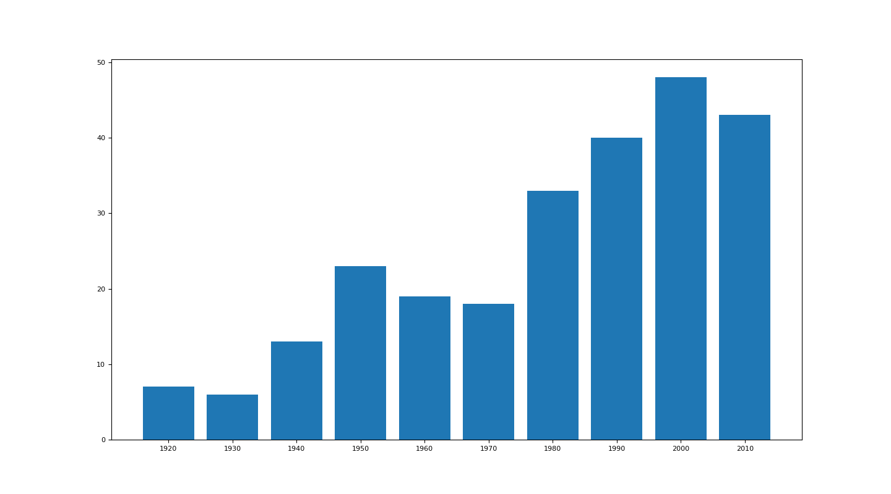
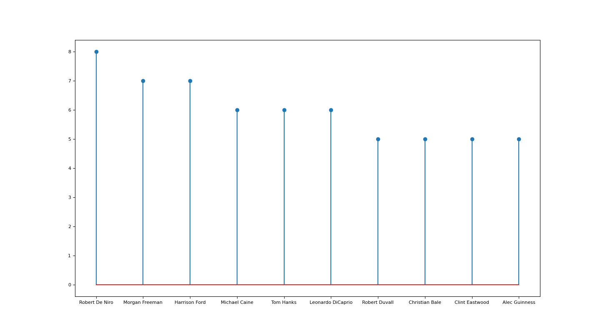
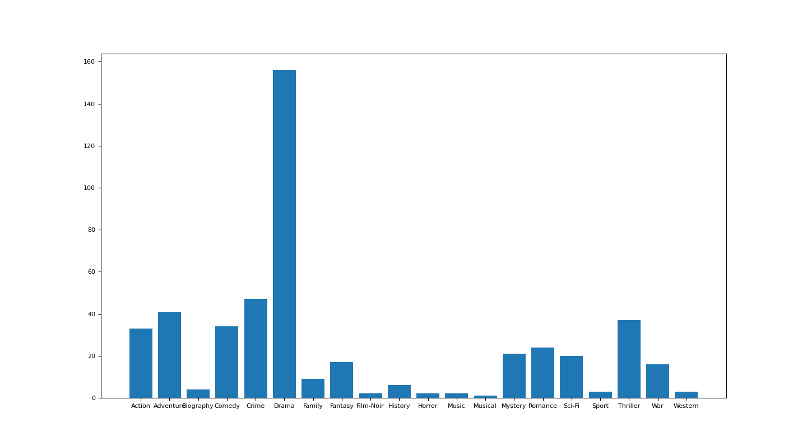

# Exercise 1 - Data Stewardship (2020S)

The purpose of this repository is to extract useful information about the IMDB's ([https://www.imdb.com](https://www.imdb.com)) Top 250 list. Said list comprises the 250 highest rated movies on the platform and we are using a 2019 snapshot of it, which was created by [Nigel Cox](https://www.kaggle.com/bartius) and can be found [here](https://www.kaggle.com/bartius/imdb-top-250-movies-info/data).

The particular tasks were to create plots that illustrate the distribution of the movies per decade, the most popular actors in the list and also the most popular genres.

The data transformation and visualization was done using the [Python](https://www.python.org/) programming language, more specifically Python version 3.7.4. In order to replicate the results please make sure you are on this version, e.g. by using a [virtual environment](https://virtualenv.pypa.io/en/stable/) or a compatible [Docker image](https://github.com/docker-library/python/blob/695bd3c10cdf1692a2af9abdc51f0eff99731e78/3.7/alpine3.10/Dockerfile). 

If you are in the correct folder (`src/`) and have installed all required dependencies using 

	$ pip3 install -r requirements.txt

(or in some cases `pip` may be used instead of pip3), you can generate the plots using the following command:
 
	$ python3 plots.py
 
 
### Generated plots

<figure>

<figcaption>Figure 1: Bar plot of the distribution of decades movies were released in IMDB's top 250</figcaption>
</figure>

<figure>

<figcaption>Figure 2: Lollipop plot of the 10 most popular actresses and actors in IMDB's top 250</figcaption>
</figure>

<figure>

<figcaption>Figure 3: Bar plot of the distribution of genres in IMDB's top 250</figcaption>
</figure>